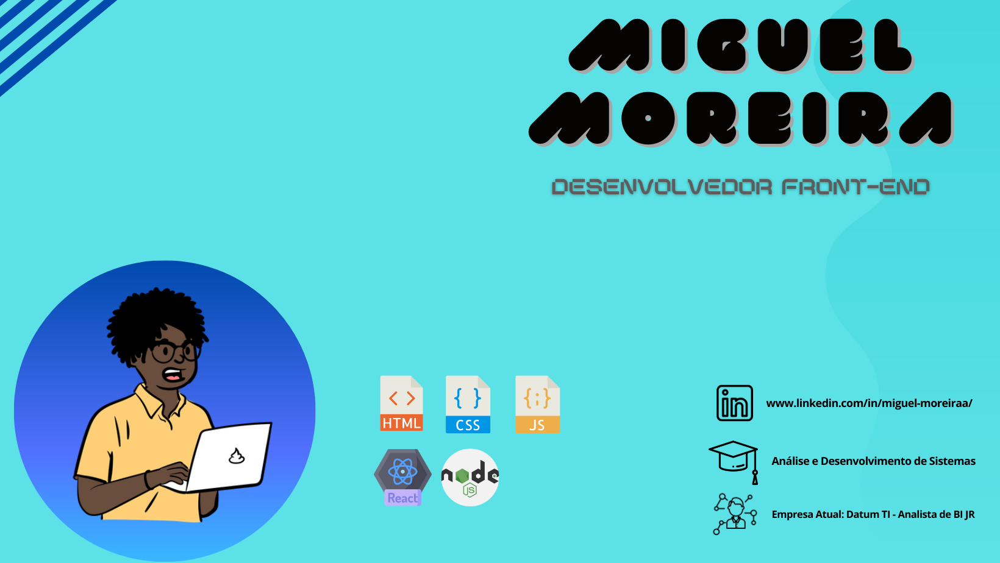

<table>
    <tr>
        <td></td>
        <td></td>
    </tr>   
</table>

### Olá! :)

---

Sou desenvolvedor front-end mas atualmente atuo como Analista de BI. Consegui meu primeiro emprego na área em 2020, graduado em análise e desenvolvimento de sistemas. Atualmente estudo 2h por dia, para melhor desenvolvimento com as ferramentas como JavaScript, Nodejs e Reactjs. 

Amo samba, toco cavaco e banjo, sou alegre e muito sorridente, gosto muito de desafios e coisas novas. :heart:

### Hello! :)
---

I'm a front-end developer, but I currently work as a BI Analyst. I got my first job in the field in 2020, graduated in systems analysis and development. Currently I study 2 hours a day, for the best development with tools such as JavaScript, Nodejs and Reactjs.

I love samba, I play cavaco and banjo, I'm happy and very smiling, I really like challenges and new things. :heart:

---

